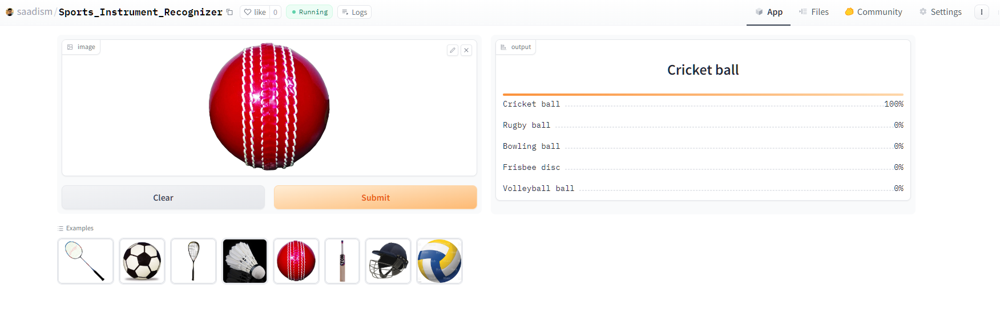

# Sports-Instrument-Recognizer
A project that uses fast ai and resnet34 to predict images of sports instrument and equipments.  

The goal of this project is to classify 20 different types of sports equipment or instrument popular around the globe.   The types are following:  
1. Basket ball
2. Soccer ball
3. Goal keeping gloves
4. Rugby ball
5. Baseball bat
6. Tennis racket
7. Golf club
8. Cricket bat
9. Cricket ball
10. Cricket helmet
11. Hockey stick
12. Hockey helmet
13. Volleyball ball
14. Table tennis paddle
15. Badminton racket
16. Badminton cork
17. Squash racket
18. Lacrosse stick
19. Frisbee disc
20. Bowling ball
21. Pool cue

# Dataset Preparation
**Data Collection:** Downloaded from DuckDuckGo using term name  
**DataLoader:** Used fastai DataBlock API to set up the DataLoader.  
**Data Augmentation:** fastai provides default data augmentation which operates in GPU.  
Details can be found in `notebooks/data_prep_sport_instrument.ipynb`

# Training and Data Cleaning
**Training:** A resnet34 model for 3 epochs (2 times) and got upto ~92% accuracy.  
**Data Cleaning:** Data cleaning was the most time-consuming part of the project. The data I collected from the web was noisy and contained irrelevant content. I used the fastai ImageClassifierCleaner to clean and update the data. I cleaned the data after each training or finetuning iteration, except for the final iteration, which was the final version of the model.  

# Model Deployment
I deployed to model to HuggingFace Spaces Gradio App. The implementation can be found in `deployment` folder or [here](https://huggingface.co/spaces/saadism/Sports_Instrument_Recognizer).  

# API integration with GitHub Pages
The deployed model API is integrated [here](https://saadism777.github.io/Sports-Instrument-Recognizer/) in GitHub Pages Website. Implementation and other details can be found in `docs` folder.
